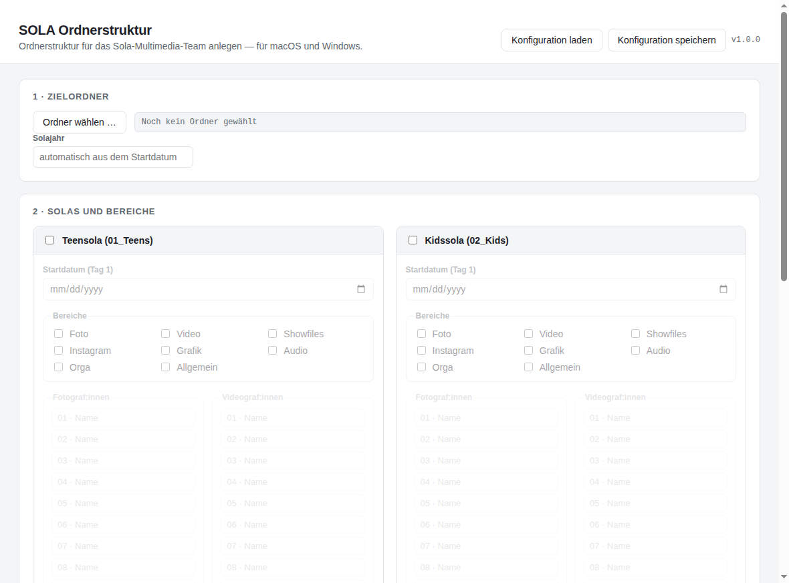
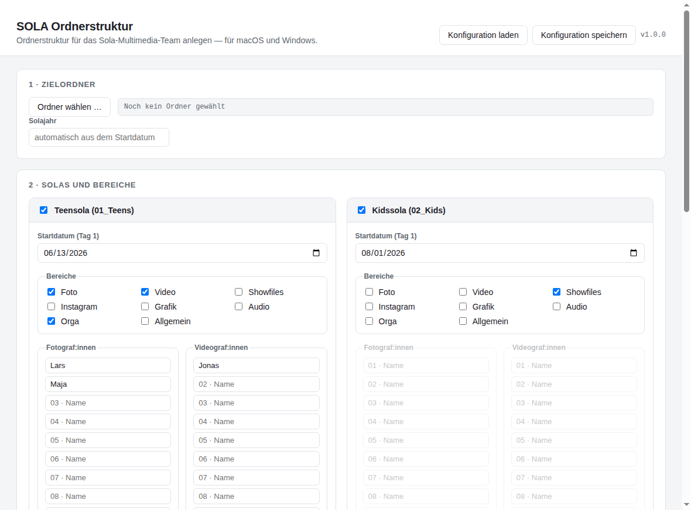
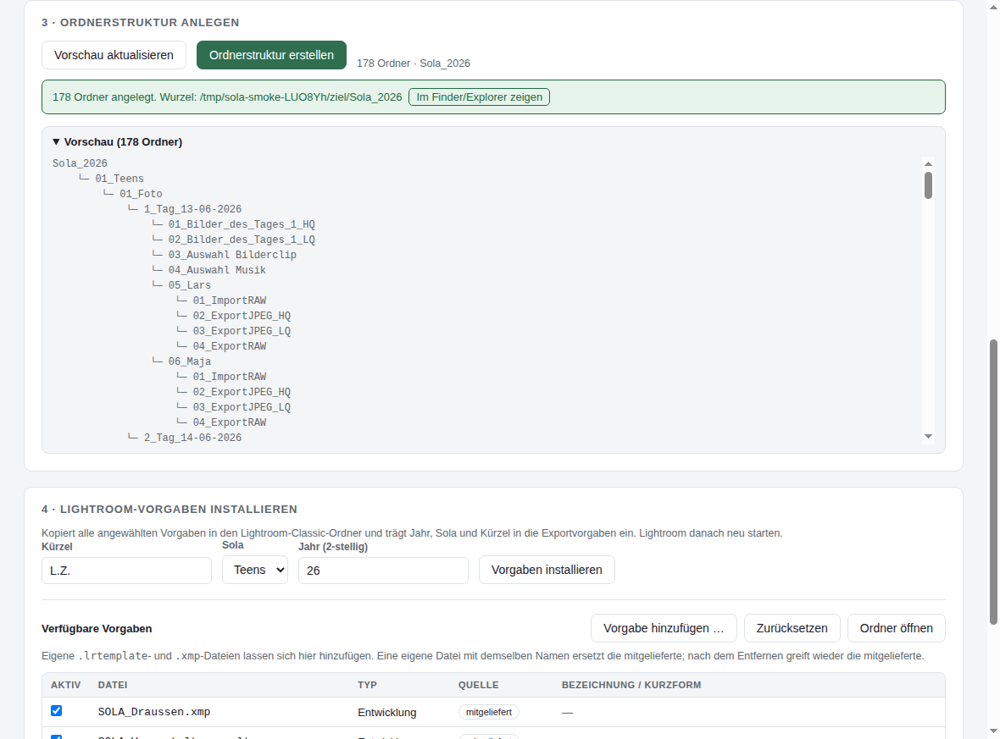
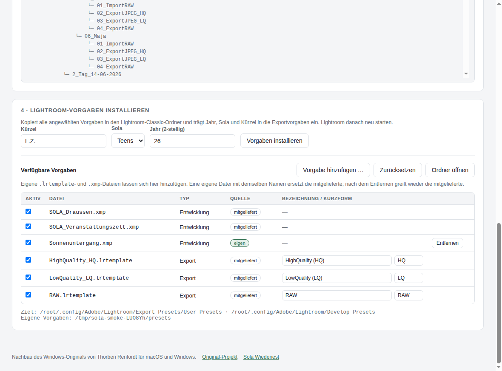
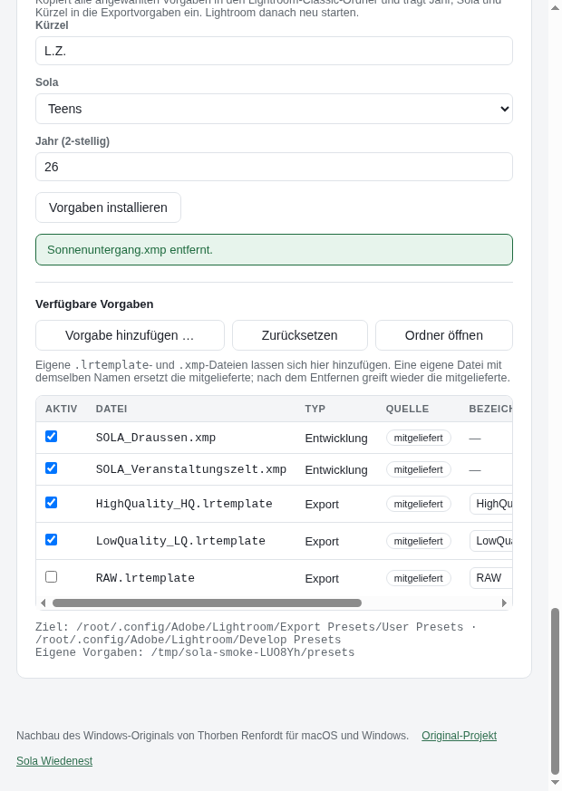

# SOLA Ordnerstruktur

Legt die Ordnerstruktur für das Sola-Multimedia-Team an und installiert die
Lightroom-Vorgaben — **auf macOS und auf Windows**.

Das ist ein Nachbau von
[TH0RB3Nger/SOLA_Ordnerstrucktur](https://github.com/TH0RB3Nger/SOLA_Ordnerstrucktur)
(VB.NET / WinForms, nur Windows) als Electron-App, damit dasselbe Programm auf
beiden Plattformen läuft.

## Die App

| | |
| --- | --- |
|  |  |
| Startzustand | Ausgefüllt, mit Vorschau des Baums |
|  |  |
| Angelegt — Vorschau und Ergebnis stimmen überein | Verwaltung der Lightroom-Vorgaben |

Die Oberfläche passt sich der Fensterbreite an; unter 900 px stehen die beiden Solas
untereinander, unter 620 px auch die Namensspalten:



Die Bilder entstehen beim Headless-Durchlauf (`npm run smoke`) und sind damit immer
der tatsächliche Stand der App.

## Installation

Fertige Pakete liegen unter [Releases](../../releases). Die Dateien entstehen
automatisch per GitHub Actions (`.github/workflows/build.yml`) für jeden Tag `v*`.

| Plattform | Datei |
| --- | --- |
| macOS (Apple Silicon) | `SOLA-Ordnerstruktur-<version>-arm64.dmg` |
| macOS (Intel) | `SOLA-Ordnerstruktur-<version>-x64.dmg` |
| Windows (Installer) | `SOLA-Ordnerstruktur-<version>-x64-Setup.exe` |
| Windows (ohne Installation) | `SOLA-Ordnerstruktur-<version>-x64-portable.exe` |

### Hinweis zur ersten Ausführung

Die Pakete sind **nicht signiert** — für eine Signatur braucht es ein
kostenpflichtiges Apple-Developer- bzw. Code-Signing-Zertifikat.

* **macOS:** Beim ersten Start meldet Gatekeeper, die App stamme von einem
  unbekannten Entwickler. Rechtsklick auf die App → *Öffnen* → *Öffnen*.
  Falls macOS die App als „beschädigt" bezeichnet, hilft im Terminal:
  `xattr -dr com.apple.quarantine "/Applications/SOLA Ordnerstruktur.app"`
* **Windows:** SmartScreen zeigt *„Der Computer wurde geschützt"* →
  *Weitere Informationen* → *Trotzdem ausführen*.

## Benutzung

1. **Zielordner** wählen — dort entsteht der Ordner `Sola_<Jahr>`.
2. **Teensola und/oder Kidssola** anhaken, jeweils Startdatum (Tag 1) und
   Bereiche wählen. Bei *Foto* bzw. *Video* die Namen eintragen; die
   Namensfelder sind nur freigegeben, wenn der Bereich angewählt ist.
3. **Vorschau** prüfen und **Ordnerstruktur erstellen** klicken. Die Vorschau
   zeigt exakt das, was danach auf der Platte landet.
4. Optional: **Lightroom-Vorgaben installieren** — Kürzel (z. B. `M.U.`), Sola
   und zweistelliges Jahr eintragen. Lightroom danach neu starten.

Konfigurationen lassen sich über *Konfiguration speichern* / *laden* (auch per
`⌘S`/`Strg+S` und `⌘O`/`Strg+O`) sichern und wieder einlesen.

Das Anlegen ist **wiederholbar**: Vorhandene Ordner werden übersprungen, nicht
überschrieben. Wer nachträglich eine Person ergänzt, kann den Vorgang einfach
noch einmal starten — der bestehende Inhalt bleibt unangetastet.

## Die erzeugte Struktur

```
Sola_2026/
├── 01_Teens/
│   ├── 01_Foto/
│   │   ├── 1_Tag_13-06-2026/
│   │   │   ├── 01_Bilder_des_Tages_1_HQ/
│   │   │   ├── 02_Bilder_des_Tages_1_LQ/
│   │   │   ├── 03_Auswahl Bilderclip/
│   │   │   ├── 04_Auswahl Musik/
│   │   │   └── 05_<Name>/            (je Fotograf:in)
│   │   │       ├── 01_ImportRAW/
│   │   │       ├── 02_ExportJPEG_HQ/
│   │   │       ├── 03_ExportJPEG_LQ/
│   │   │       └── 04_ExportRAW/
│   │   ├── … 2_Tag bis 8_Tag …
│   │   └── LR Kataloge/
│   │       └── 01_<Name>/            (je Fotograf:in)
│   ├── 02_Video/
│   │   └── 1_Tag_13-06-2026/
│   │       ├── 01_Rohvideos/
│   │       │   └── 01_<Name>/        (je Videograf:in)
│   │       ├── 02_Projektdatein/
│   │       └── 03_Audio-Musik/
│   ├── 03_Showfiles/                 (nur Tagesordner)
│   ├── 04_Instagram/
│   ├── 05_Grafik/
│   ├── 06_Audio/                     (nur Tagesordner)
│   ├── 07_Orga/
│   └── 08_Allgemein/
└── 02_Kids/                          (gleicher Aufbau)
```

Die Bereiche werden in der festen Reihenfolge *Foto, Video, Showfiles,
Instagram, Grafik, Audio, Orga, Allgemein* nummeriert — nur angewählte Bereiche
verbrauchen eine Nummer. Sind also nur *Video* und *Orga* gewählt, entstehen
`01_Video` und `02_Orga`.

Ein Sola dauert acht Tage (Tag 1 bis Tag 8), gerechnet ab dem Startdatum.

### Abweichungen zum Windows-Original

Die Struktur ist die des Originals, an drei Stellen aber vereinheitlicht — im
Original hatten Teens und Kids uneinheitliche Namen, teils mit fehlendem
Trennzeichen oder als roher `Date`-Wert:

* Tagesordner heißen jetzt überall `<n>_Tag_<dd-MM-yyyy>` (Original: mal
  `_Tag_1_13-06-2022`, mal `Tag_1_Mon Jun 13 2022 …`, im Audio-Ordner
  `_Tag_113-06-2022`).
* Bei Kids wird derselbe formatierte Datumsstring verwendet wie bei Teens.
* Fehlerhafte Zeichen in Namen (`/`, `:`, `\`, …) werden zu `_`, damit derselbe
  Name auf macOS und Windows funktioniert. Auch die unter Windows reservierten
  Namen (`CON`, `PRN`, `LPT1`, …) sind abgefangen.

Sonst gilt: gleiche Ordnernamen, gleiche Nummerierung, gleiche Lightroom-Vorgaben.

### Konfigurationsdateien

Gespeichert wird wahlweise als **JSON** (Standard) oder als **CSV** im Format
des Windows-Originals — CSV-Dateien aus der alten Version lassen sich also
direkt laden. Beim Datum werden `dd-MM-yyyy`, `dd.MM.yyyy`, `MM/dd/yyyy` und
ISO `yyyy-MM-dd` erkannt.

## Lightroom-Vorgaben

Mitgeliefert werden drei Exportvorgaben (`HighQuality_HQ`, `LowQuality_LQ`,
`RAW`) und zwei Entwicklungsvorgaben (`SOLA_Draussen`,
`SOLA_Veranstaltungszelt`). In die Exportvorgaben trägt die App
`internalName`, `title`, `tokenCustomString` und `tokens` ein, also
z. B. `SOLA26_Teens_HighQuality (HQ)` und das Kürzel.

### Eigene Vorgaben

Die mitgelieferten Vorgaben sind nur der Ausgangspunkt — unter *Verfügbare
Vorgaben* lässt sich der Bestand ändern, ohne die App neu zu bauen:

* **Hinzufügen** — beliebige `.lrtemplate`- und `.xmp`-Dateien einlesen, auch
  mehrere auf einmal.
* **Ersetzen** — eine eigene Datei mit demselben Dateinamen tritt an die Stelle
  der mitgelieferten. Nach dem *Entfernen* greift wieder die mitgelieferte;
  überschrieben wird nichts.
* **Ab- und anwählen** — jede Vorgabe hat ein Häkchen. Nur angehakte werden
  installiert. Mitgelieferte lassen sich abwählen, aber nicht löschen.
* **Bezeichnung und Kurzform** — bei Exportvorgaben direkt in der Tabelle
  editierbar. Sie landen im Vorgabennamen (`SOLA26_Teens_<Bezeichnung>`) und im
  Dateinamen-Token (`…_<Kurz>_{{image_name}}`). Bei neuen Dateien schlägt die
  App beides aus dem Dateinamen vor.
* **Zurücksetzen** — verwirft alle eigenen Vorgaben und Abwahlen.

Eigene Vorgaben liegen im Benutzerdatenordner der App und überstehen damit ein
Update. Der Pfad steht in der App unter Punkt 4; *Ordner öffnen* springt hin.

Zielordner beim Installieren:

| Plattform | Pfad |
| --- | --- |
| macOS | `~/Library/Application Support/Adobe/Lightroom/{Develop Presets, Export Presets/User Presets}` |
| Windows | `%APPDATA%\Adobe\Lightroom\{Develop Presets, Export Presets\User Presets}` |

Der tatsächlich verwendete Pfad steht in der App unter Punkt 4.

## Entwicklung

```bash
npm install
npm start          # App starten
npm test           # Tests der Kernlogik (node:test, ohne Oberfläche)
npm run smoke      # Headless-Durchlauf durch die echte App (Linux, via xvfb-run)
npm run smoke:mac  # derselbe Durchlauf auf macOS/Windows, mit sichtbarem Fenster
npm run dist:mac   # .dmg bauen (nur auf macOS)
npm run dist:win   # .exe bauen (auf Windows; via wine auch anderswo)
```

### Headless-Durchlauf

`npm run smoke` startet den echten Hauptprozess, füllt das Formular, legt eine
Ordnerstruktur in einem temporären Ordner an und prüft unter anderem:

* die Vorschau zeigt genau den Baum, der danach auf der Platte liegt,
* die Tagesordner sortieren nach Tag und stehen vor `LR Kataloge`,
* eine eigene Vorgabe erscheint in der Tabelle, lässt sich abwählen und entfernen,
* bei 1180, 760 und 620 px Fensterbreite scrollt die Seite nicht seitlich.

Dabei entstehen die Screenshots in `docs/screenshots/`. Der Lauf endet mit
Code 1, sobald eine Prüfung fehlschlägt — er taugt also für CI.

### Aufbau

```
src/core/       Plattformunabhängige Logik, ohne Electron-Abhängigkeit
  structure.js    baut den Ordnerbaum als Liste relativer Pfade (rein funktional)
  createStructure.js  legt diese Liste auf der Platte an
  lightroom.js    Preset-Pfade je Plattform, Kopieren und Anpassen
  presetStore.js  führt mitgelieferte und eigene Vorgaben zusammen
  config.js       JSON- und CSV-Format (Letzteres kompatibel zum Original)
  dates.js        Tagesberechnung, Solajahr
  validate.js     Namensprüfung und Absicherung der Ordnernamen
src/main/       Electron-Hauptprozess: Fenster, Menü, Dialoge, IPC
src/renderer/   Oberfläche (HTML/CSS/JS, ohne Node-Zugriff)
scripts/smoke.js    Headless-Durchlauf, erzeugt zugleich die Screenshots
resources/presets/  Die mitgelieferten Lightroom-Vorlagen
```

`structure.js` ist bewusst rein funktional: Die Vorschau in der Oberfläche und
das tatsächliche Anlegen benutzen dieselbe Liste, sie können also nicht
auseinanderlaufen. Getestet wird gegen diese Liste und gegen einen echten
Anlagevorgang in einem temporären Ordner.

Ordnernamen und Unterordner stehen als Konstanten am Kopf von
`src/core/structure.js` — wer die Struktur anpassen will, ändert sie dort.

## Lizenz

MIT — siehe [LICENSE](LICENSE). Ursprüngliches Werk und Lightroom-Vorgaben:
Thorben Renfordt.
